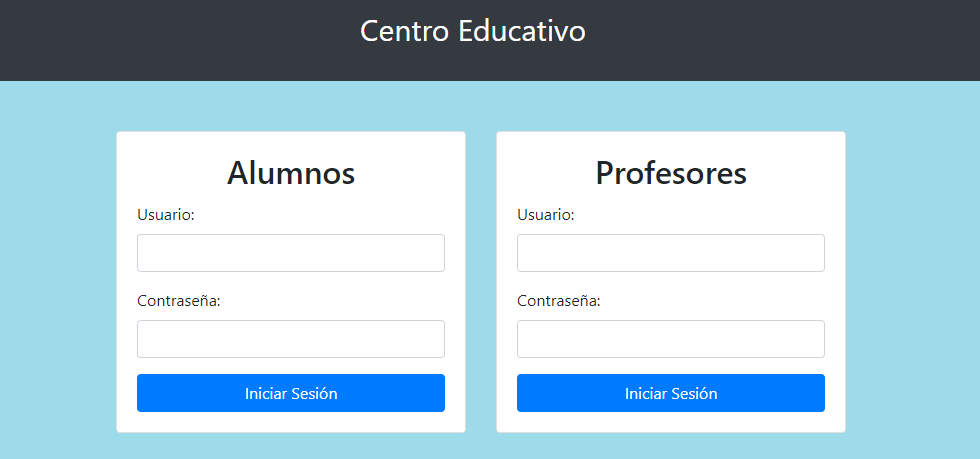
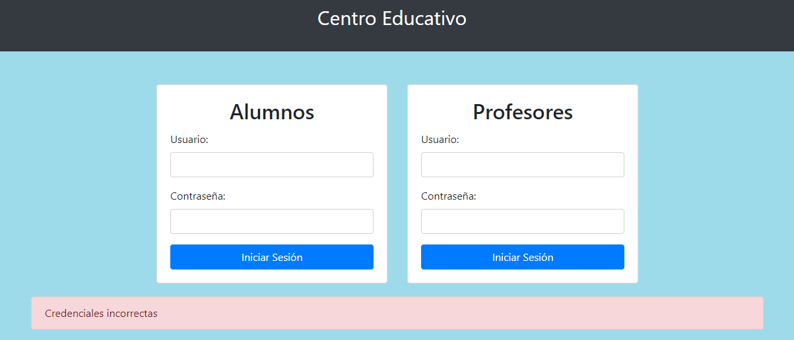
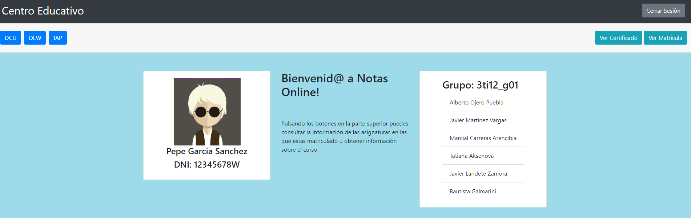
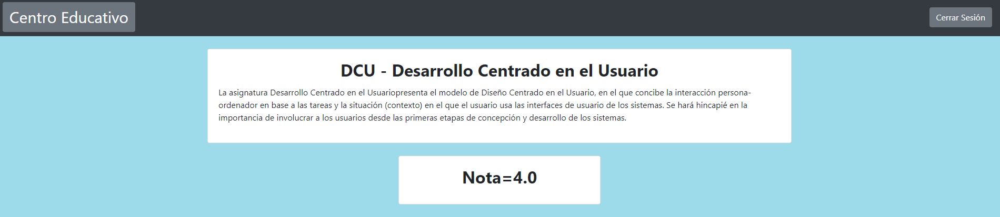
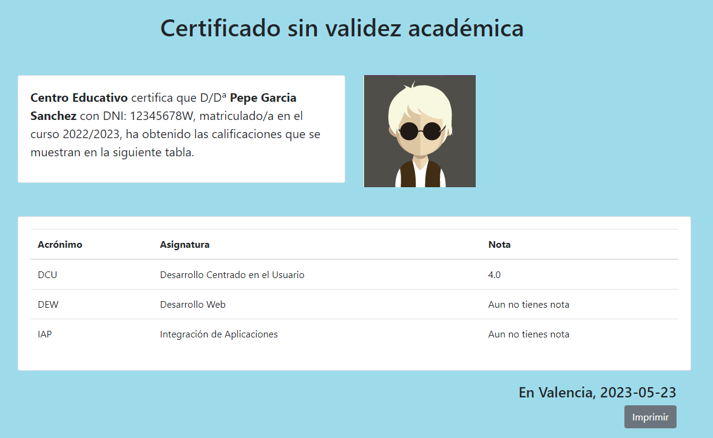
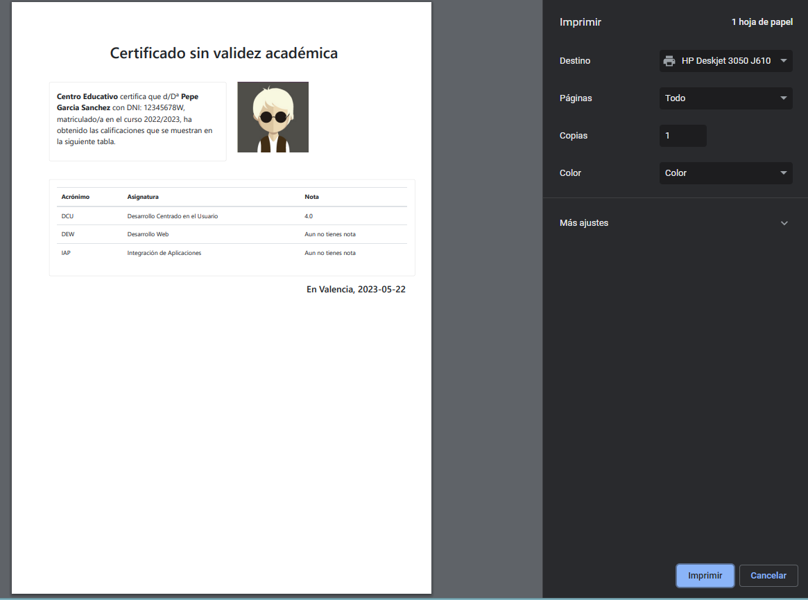
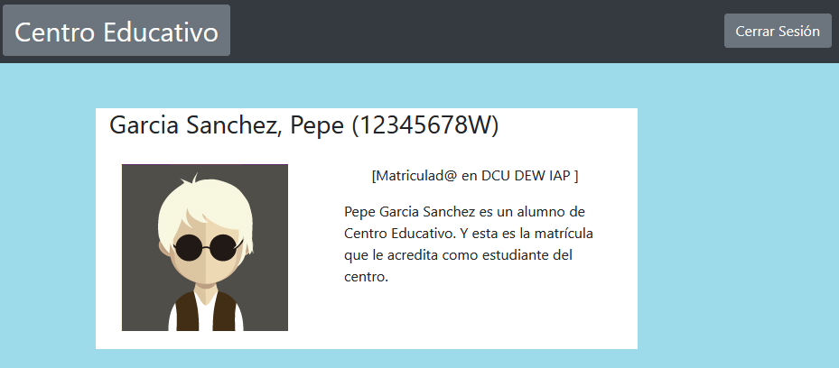
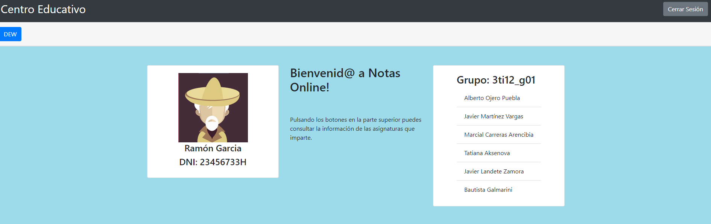
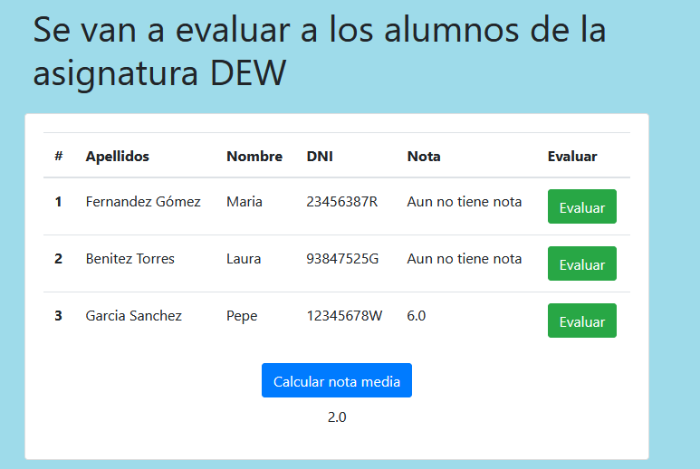

# Notas Online
> [!Note]
> Trabajo en grupo desarrollado en la asignatura de DEW 

## Introducción

La funcionalidad de la aplicación Notas Online se centra en la gestión de calificaciones. Los alumnos pueden acceder a sus notas en las asignaturas en las que están matriculados y obtener certificados de calificaciones. Al mismo tiempo, los profesores tienen la capacidad de evaluar a los estudiantes en las materias que imparten.

## Tecnologias usadas

    

## Guia de uso

A la hora de utilizar lo desarrollado se comprime el proyecto en un ".war" que es guardado en el directorio "/ruta/de/tu/tomcat/webapps/" donde una vez iniciado Apache Tomcat con "startup.sh" desde bin se puede comprobar la disponibilidad de la web en "http://localhost:8080/nol"

En el repositorio se incluyen los dos ficheros html iniciales y una carpeta con los avatares de los usuarios. El código java desarrollado se encuentra en la carpeta classes de WEB-INF.

## Capturas
Aqui se adjuntan una serie de capturas de las páginas resultantes del proyecto.

### Login

### Alumno

### Profesor

